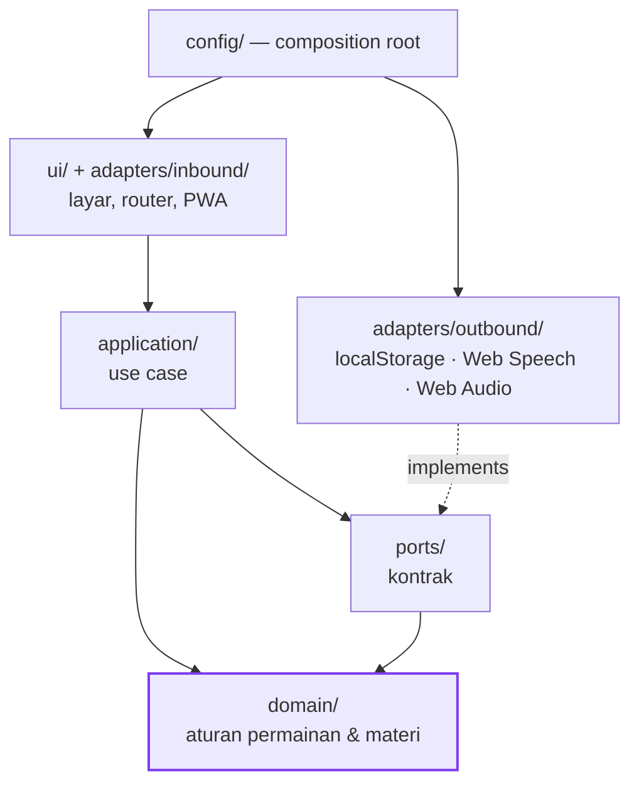

# Baca Yuk, Darlene! 📚⭐

Dashboard latihan membaca **Bahasa Indonesia + Bahasa Inggris** untuk Darlene
(5 tahun, K2), dikemas sebagai permainan bergaya Duolingo: XP, level, bintang,
medali, misi harian, dan poin prestasi.

Aplikasi bisa **dipasang ke layar utama lewat Safari (iPhone/iPad) dan Chrome
(Android/desktop)**, berjalan penuh **tanpa internet**, dan menyimpan progres
**hanya di perangkat** — tidak ada akun, tidak ada server, tidak ada pelacak.

---

## 1. Tujuan

| Untuk siapa | Apa yang didapat |
|---|---|
| Darlene | 46 pelajaran berisi 14 jenis permainan membaca: kenal huruf, suku kata, tebak gambar, dengar & pilih, susun huruf, susun kalimat, baca keras, terjemah |
| Orang tua | Statistik kemajuan, grafik XP 14 hari, daftar 190 kata beserta tingkat penguasaannya, pengaturan suara, cadangan & pemulihan data |

**Isi materi:** 83 kata Indonesia · 107 kata Inggris (termasuk 26 sight words) ·
26 huruf dengan contoh dua bahasa · 16 keluarga suku kata · 20 kalimat pendek.

### Mekanika permainan

- **XP & level** — 10 XP per jawaban benar, bonus 20 XP tiap pelajaran, +15 XP bila sempurna. 11 tingkat gelar dari *Pembaca Cilik* sampai *Legenda Baca*.
- **Bintang** — 3 bintang tanpa salah, 2 bintang bila maksimal dua kali salah, minimal selalu 1. Anak tidak pernah "kalah".
- **Medali unit** — 🥉 semua pelajaran selesai · 🥈 rata-rata 2 bintang · 🥇 semua pelajaran 3 bintang.
- **Misi harian** — 3 misi diundi tiap hari (tetap sama sepanjang hari itu), berhadiah XP + poin prestasi.
- **Lencana prestasi** — 30 lencana, total 1.515 poin.
- **Beruntun (streak)** — 🔥 bertambah setiap hari belajar.
- **Penguasaan kata** — setiap kata punya skor 0–5; naik saat benar, turun saat salah.

## 2. Arsitektur singkat

Gaya: **Modular Monolith = Layered + Ports & Adapters**
(sesuai `docs/architecture/STANDAR-ARSITEKTUR-v1.0.md`).



Dependensi hanya mengarah ke dalam; `domain/` tidak mengimpor apa pun dari luar
dan dilarang menyentuh DOM, `localStorage`, `fetch`, `Math.random()`, atau
`Date.now()` — ditegakkan otomatis oleh aturan lint di CI.

Dokumen lengkap: [`docs/architecture/`](docs/architecture/) —
[ikhtisar](docs/architecture/00-overview.md) ·
[skenario mutu](docs/architecture/01-quality-attributes.md) ·
[view logis](docs/architecture/02-views/logical.md) ·
[deployment](docs/architecture/02-views/deployment.md) ·
[proses](docs/architecture/02-views/process.md) ·
[evaluasi & utang teknis](docs/architecture/03-evaluation.md) ·
[7 ADR](docs/architecture/adr/).

## 3. Prasyarat

- **Node.js ≥ 20** (untuk build, test, dan server lokal)
- **python3** — hanya bila ingin membuat ulang ikon
- Akun **Cloudflare** + **GitHub** — hanya untuk deploy

Tidak ada dependensi npm sama sekali; `npm install` tidak diperlukan.

## 4. Instalasi

```bash
git clone https://github.com/andwowor/Latihan-Membaca-Darlene.git
cd Latihan-Membaca-Darlene
```

Selesai — tidak ada langkah lain.

## 5. Menjalankan

```bash
npm run dev      # build + server statis di http://localhost:4173
```

Buka `http://localhost:4173` di peramban. Untuk mencoba pemasangan PWA,
akses lewat HTTPS (hasil deploy) karena service worker hanya aktif di
`localhost` dan HTTPS.

## 6. Test

```bash
npm test         # 121 test — unit, integrasi, e2e (runner bawaan Node)
```

Piramida test:

| Lapis | Lokasi | Cakupan |
|---|---|---|
| Unit | `tests/unit/` | seluruh aturan `domain/` + utilitas `shared/`, termasuk dua test regresi bug pengecoh soal |
| Integrasi | `tests/integration/` | adapter penyimpanan (termasuk mode penyamaran & kuota penuh), kepatuhan adapter pada kontrak port, layanan query |
| E2E | `tests/e2e/` | alur penuh tanpa DOM: mengerjakan pelajaran, medali, misi, ganti hari, cadangan/pulih, reset, menamatkan seluruh peta |

Mutu kode (kompleksitas ≤ 10 & aturan lapisan):

```bash
npx --yes eslint@10 src scripts tests eslint.config.js
```

## 7. Deploy

Ringkas — lengkapnya di [`docs/runbook.md`](docs/runbook.md).

1. Simpan dua GitHub Secrets: `CLOUDFLARE_API_TOKEN` dan `CLOUDFLARE_ACCOUNT_ID`.
2. `git push` ke `main` → GitHub Actions menjalankan test, build, lalu
   `wrangler deploy` ke **Cloudflare Workers (static assets)**.

Alternatif tanpa token: **Cloudflare Pages → Connect to Git**, build command
`npm run build`, output directory `dist`.

## 8. Runbook

Cara memasang di iPhone/Android, menambah kata baru, merilis versi, dan
memulihkan masalah (progres hilang, suara tidak keluar, dll):
[`docs/runbook.md`](docs/runbook.md).

## 9. Struktur folder

```
├── docs/architecture/     # standar, QAS, 3 view, evaluasi, ADR
├── docs/runbook.md
├── public/                # kerangka statis: index.html, css, ikon, manifest, sw
├── src/
│   ├── domain/            # entitas & aturan murni (kosakata, kurikulum, XP, misi…)
│   ├── application/       # use case
│   ├── ports/             # kontrak ke dunia luar
│   ├── adapters/          # inbound (router, PWA) & outbound (storage, suara)
│   ├── config/            # composition root + bootstrap
│   ├── shared/            # utilitas murni
│   └── ui/                # layar & komponen tampilan
├── tests/{unit,integration,e2e}/
├── scripts/               # build.mjs, dev.mjs
├── tools/make_icons.py    # generator ikon PWA
└── wrangler.jsonc
```

## 10. Lisensi

MIT — bebas dipakai dan diubah. Dibuat dengan ❤️ untuk Darlene.
