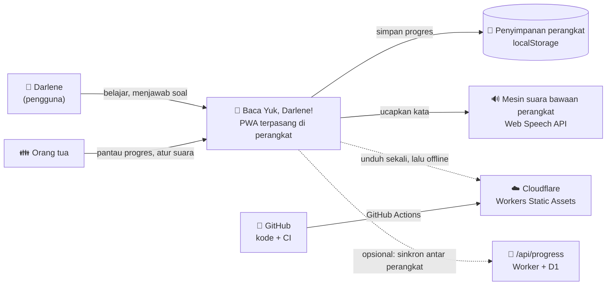

# 00 — Ikhtisar Arsitektur / Architecture Overview

**Sistem:** Baca Yuk, Darlene! — dashboard latihan membaca dwibahasa
**Versi dokumen:** 1.0 · **Tanggal:** 2026-08-25
**Standar acuan:** `docs/architecture/STANDAR-ARSITEKTUR-v1.0.md` (Wowor, v1.0), ISO/IEC/IEEE 42010:2022

---

## 1. Tujuan Sistem

Membantu Darlene (5 tahun, kelas K2) berlatih membaca **Bahasa Indonesia dan Bahasa Inggris**
setiap hari, dengan mekanisme permainan bergaya Duolingo: XP, level, bintang, medali,
misi harian, dan poin prestasi. Aplikasi dipasang di layar utama ponsel/tablet
(Safari iOS dan Chrome/Android) dan tetap bisa dipakai tanpa internet.

**Bukan tujuan sistem** (agar batas ruang lingkup jelas):
- bukan aplikasi multi-pengguna atau kelas daring;
- tidak mengumpulkan data anak ke server mana pun;
- tidak memerlukan akun, login, maupun basis data.

## 2. Pemangku Kepentingan & Kepentingannya (ISO 42010)

| Pemangku kepentingan | Kepentingan (concern) | Viewpoint yang menjawab |
|---|---|---|
| Darlene (pengguna, 5 th) | Mudah dipakai sendiri, cepat, menyenangkan, tidak menghukum saat salah | Logical (UI), Process |
| Orang tua (pemilik sistem) | Progres terpantau, data anak aman, gampang dipasang, gampang dirawat | Deployment, Logical |
| Pengembang (solo) | Bisa menambah materi tanpa membongkar arsitektur; perubahan aman | Logical, ADR |
| Cloudflare (platform) | Berkas statis, tanpa server, biaya nol | Deployment |

## 3. Konteks Sistem (C4 Level 1)

Setelah kunjungan pertama, seluruh berkas dilayani service worker dari cache
perangkat; mengerjakan pelajaran tidak pernah memerlukan jaringan. Satu-satunya
lalu lintas jaringan saat berjalan adalah sinkronisasi progres antar perangkat,
yang bersifat opsional dan mati secara bawaan (lihat `adr/ADR-0008`).

## 4. Gaya Arsitektur yang Dipilih

**Modular Monolith = Layered + Ports & Adapters**, sesuai default resmi Standar §3.
Alasan singkat (lengkapnya di `adr/ADR-0001`):

- pengembang tunggal → Hukum Conway (Conway, 1968) melarang microservices;
- ada beberapa sistem eksternal yang mudah berubah (penyimpanan, mesin suara,
  hosting) → tiap satu disembunyikan di balik satu port (Parnas, 1972);
- kebutuhan mutu utama adalah *modifiability* dan *usability*, bukan *scalability*.

## 5. Peta Modul Tingkat Atas

| Lapisan | Isi | Keputusan yang disembunyikan |
|---|---|---|
| `src/domain/` | kosakata, kurikulum, XP & level, streak, penguasaan kata, bintang, medali, misi, achievement, pembuat soal, perkenalan materi, penggabungan profil, kode sinkron | aturan permainan & materi belajar |
| `src/application/` | ProfileService, LessonSession, DailyMissionService, ProgressQueryService, SyncService | urutan langkah tiap use case |
| `src/ports/` | ProgressRepository, SpeechPort, SoundPort, ClockPort, RandomPort, SyncPort | kontrak ke dunia luar |
| `src/adapters/outbound/` | localStorage, Web Speech, Web Audio, jam sistem, Math.random, HTTP sinkronisasi, penyimpanan D1 | teknologi konkret |
| `src/adapters/inbound/` | hash router, install prompt, service worker client, Worker HTTP (sisi server) | cara sistem dipicu |
| `src/ui/` | layar & komponen tampilan | tata letak dan gaya visual |
| `src/config/` | container (composition root), environment, bootstrap | perakitan dependensi |
| `src/shared/` | koleksi, tanggal, keacakan | utilitas murni tanpa aturan bisnis |

## 6. Dokumen Terkait

- `01-quality-attributes.md` — skenario mutu enam bagian (spesifikasi arsitektur)
- `02-views/logical.md`, `02-views/deployment.md`, `02-views/process.md` — tiga view wajib
- `03-evaluation.md` — evaluasi gaya ATAM ringan + utang teknis
- `adr/` — catatan keputusan arsitektur
- `../runbook.md` — cara mengoperasikan & memulihkan sistem
