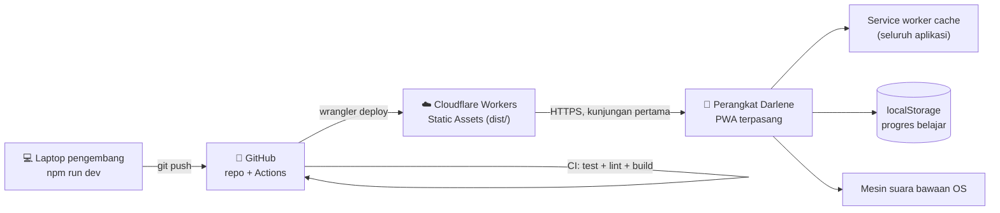

# View Deployment / Deployment View (Kruchten 4+1)

Menjawab kepentingan: *di mana perangkat lunak ini berjalan, bagaimana ia sampai
ke sana, dan apa yang bisa gagal.*

## 1. Topologi

## 2. Artefak yang Dikirim

`npm run build` menghasilkan `dist/`:

| Isi | Asal | Catatan |
|---|---|---|
| `index.html`, `css/`, `icons/`, `manifest.webmanifest` | `public/` | disalin apa adanya |
| `src/**/*.js` | `src/` | ES module asli, tanpa bundler |
| `sw.js` | `public/sw.js` + suntikan | versi & daftar precache diisi saat build |

Tidak ada langkah transpilasi, tidak ada `node_modules` di produksi,
tidak ada rahasia di dalam artefak.

## 3. Lingkungan

| Lingkungan | Cara jalan | URL |
|---|---|---|
| Lokal | `npm run dev` (server statis Node) | `http://localhost:4173` |
| Pratinjau PR | Cloudflare preview (opsional, bila memakai Pages) | URL pratinjau |
| Produksi | `wrangler deploy` lewat GitHub Actions | `https://baca-yuk-darlene.<akun>.workers.dev` atau domain khusus |

## 4. Kredensial

Hanya dua, dan keduanya **hanya** hidup sebagai GitHub Secrets
(`CLOUDFLARE_API_TOKEN`, `CLOUDFLARE_ACCOUNT_ID`). Aplikasi yang berjalan tidak
membutuhkan kredensial apa pun. `.env.example` sengaja kosong nilainya.

## 5. Mode Kegagalan & Dampaknya

| Kegagalan | Dampak pada Darlene | Pemulihan |
|---|---|---|
| Cloudflare tidak bisa dijangkau | Tidak ada — service worker melayani dari cache | otomatis |
| Deploy gagal di CI | Versi lama tetap tayang | perbaiki lalu push ulang |
| `localStorage` penuh/diblokir | Progres tidak tersimpan, aplikasi tetap jalan | mode penyamaran → pakai jendela biasa |
| Perangkat tidak punya suara Bahasa Indonesia | Soal tetap bisa dikerjakan tanpa suara | pasang suara Indonesia di setelan OS |
| Perangkat hilang / diganti | Progres hilang bila tidak dicadangkan | pulihkan dari berkas cadangan `.json` |

Rincian tindakan ada di `docs/runbook.md`.
