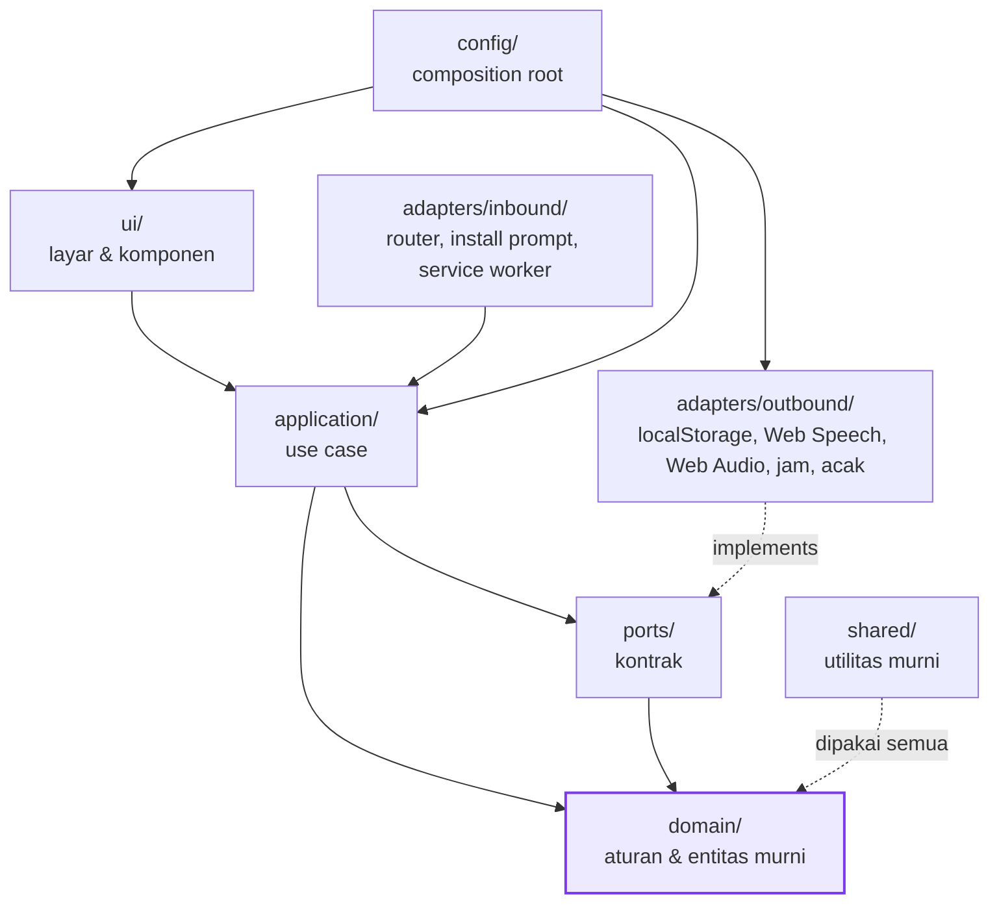
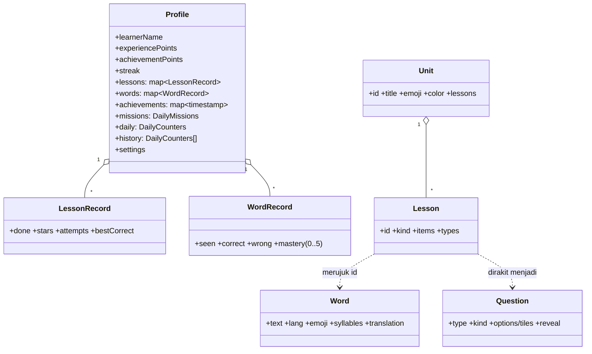
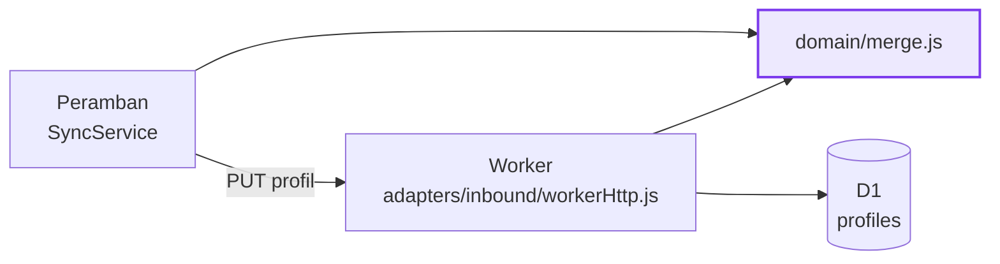

# View Logis / Logical View (Kruchten 4+1)

Menjawab kepentingan: *bagaimana sistem dipecah menjadi modul, dan apa yang
boleh bergantung pada apa.*

## 1. Lapisan & Aturan Dependensi



**Aturan yang tidak bisa dinegosiasi (Standar §4):**

```
adapters ──▶ ports ──▶ application ──▶ domain
                                        ▲
                        domain tidak menunjuk ke mana pun
```

Aturan ini **ditegakkan otomatis**, bukan sekadar niat baik:
`eslint.config.js` melarang `domain/` mengimpor lapisan luar, memakai `window`,
`document`, `localStorage`, `fetch`, `Math.random()`, maupun `Date.now()`.
Pelanggaran menggagalkan CI.

## 2. Dekomposisi Modul menurut Parnas (1972)

Pertanyaan yang dipakai: *"Keputusan apa yang paling mungkin berubah?"*

| Keputusan volatil | Disembunyikan di | Bila berubah, yang ikut berubah |
|---|---|---|
| Materi kata & kalimat | `domain/vocabulary.js` | hanya berkas itu |
| Susunan peta belajar | `domain/curriculum.js` | hanya berkas itu |
| Kurva XP & judul level | `domain/leveling.js` | hanya berkas itu |
| Rumus bintang & bonus XP | `domain/scoring.js` | hanya berkas itu |
| Aturan streak | `domain/streak.js` | hanya berkas itu |
| Ambang penguasaan kata | `domain/mastery.js` | hanya berkas itu |
| Syarat medali | `domain/medals.js` | hanya berkas itu |
| Daftar & undian misi harian | `domain/missions.js` | hanya berkas itu |
| Katalog achievement | `domain/achievements.js` | hanya berkas itu |
| Bentuk & variasi soal | `domain/exercise/` | hanya folder itu |
| Kapan & bagaimana materi diperkenalkan | `domain/exercise/introduction.js` | hanya berkas itu |
| Aturan penggabungan dua profil | `domain/merge.js` | hanya berkas itu |
| Definisi tujuan akhir & cara mengukurnya | `domain/goal.js` | hanya berkas itu |
| Bentuk & kekuatan kode pemisah profil | `domain/syncCode.js` | hanya berkas itu |
| **Cara teks Indonesia dilafalkan mesin suara asing** | `domain/pronunciation.js` | hanya berkas itu |
| **Cara progres dipertukarkan antar perangkat** | `ports/SyncPort` + adapter | satu adapter |
| Skema penyimpanan tersinkron | `adapters/outbound/d1ProfileStore.js` | satu adapter |
| **Tempat progres disimpan** | `ports/ProgressRepository` + adapter | satu adapter |
| **Mesin pengucapan kata** | `ports/SpeechPort` + adapter | satu adapter |
| **Cara efek suara dibunyikan** | `ports/SoundPort` + adapter | satu adapter |
| Sumber waktu & keacakan | `ports/ClockPort`, `ports/RandomPort` | satu adapter |
| Cara berpindah layar | `adapters/inbound/hashRouter.js` | satu adapter |
| Tata letak & warna | `ui/` + `public/css/style.css` | lapisan presentasi saja |

## 3. Entitas Domain Utama



Seluruh fungsi domain **murni**: menerima profil lama, mengembalikan profil baru
(`JSON` clone), sehingga mudah diuji dan tidak pernah bocor efek samping.

## 3b. Kode Domain yang Berjalan di Dua Tempat

`domain/merge.js` dan `domain/syncCode.js` dijalankan **di peramban maupun di
dalam Worker**. Inilah keuntungan konkret dari domain yang benar-benar murni:
aturan penggabungan progres tidak perlu ditulis dua kali, sehingga tidak mungkin
klien dan server punya pemahaman berbeda tentang siapa yang menang saat dua
perangkat bertemu.



## 4. Antarmuka Port (ringkas)

| Port | Metode | Adapter yang tersedia |
|---|---|---|
| `ProgressRepository` | `load()`, `save(profile)`, `clear()` | localStorage, memori |
| `SpeechPort` | `speak()`, `spellOut()`, `stop()`, `voicesFor()`, `isAvailable()`, `unlock()` | Web Speech, null |
| `SoundPort` | `play(effect)`, `unlock()` | Web Audio, null |
| `ClockPort` | `now()` | jam sistem, jam beku (test) |
| `RandomPort` | `next()` | `Math.random`, berbenih (test) |
| `SyncPort` | `pull()`, `push()` | HTTP ke Worker sendiri, null (offline/test) |

Setiap port mengekspor daftar metode wajibnya; `tests/integration/container.test.js`
memakai daftar itu untuk membuktikan setiap adapter benar-benar bisa
menggantikan kontraknya (Liskov & Wing, 1994).
