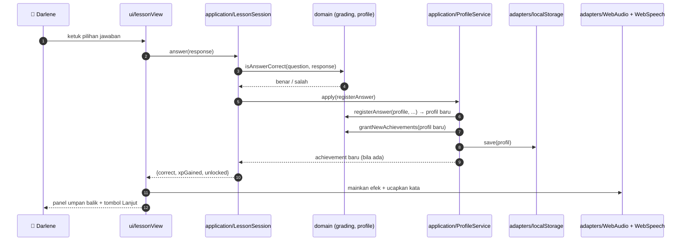
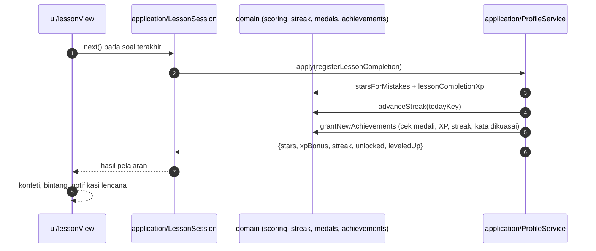
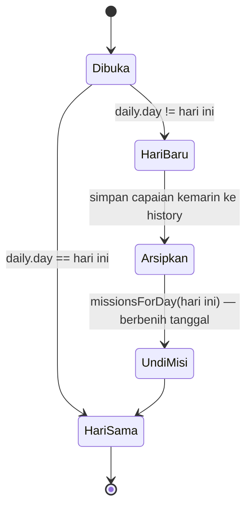

# View Proses / Process View (Kruchten 4+1)

Menjawab kepentingan: *apa yang terjadi, dalam urutan apa, saat sistem dipakai.*

Aplikasi ini berjalan **satu utas** di peramban. Tidak ada proses latar,
tidak ada pekerjaan terjadwal, tidak ada antrean. Yang perlu didokumentasikan
adalah tiga alur runtime berikut.

## 1. Menjawab satu soal

Catatan penting: **penyimpanan terjadi setiap jawaban**, bukan di akhir pelajaran.
Aplikasi yang tertutup di tengah jalan tidak menghilangkan progres.

## 2. Menyelesaikan pelajaran

## 3. Pergantian hari (misi & streak)

Tidak ada penjadwal. Pergantian hari dievaluasi **saat aplikasi dipakai**
(`rollToDay` dipanggil ketika profil dimuat dan pada setiap perubahan):

Karena undian misi berbenih tanggal (`seededRandom("darlene-YYYY-MM-DD")`),
misi hari itu tetap sama walau aplikasi ditutup dan dibuka berkali-kali,
dan tidak perlu disimpan di server.

## 4. Pembukaan kunci audio (khusus iOS)

Safari iOS melarang memutar audio sebelum ada sentuhan pengguna. Karena itu
`ui/App.js` memasang satu pendengar `pointerdown`/`keydown` yang memanggil
`container.unlockAudio()` sekali, lalu melepas dirinya sendiri.
Tanpa langkah ini, soal "dengarkan lalu pilih" akan bisu di iPhone.
